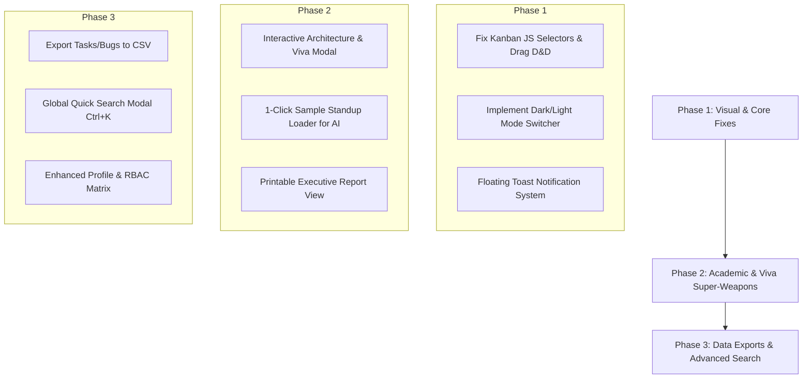

# 🚀 DEVFLOW: Project Polish & Enhancement Blueprint

> **A Strategic Roadmap to Elevate DevFlow into a High-Scoring Academic Capstone & Enterprise-Grade Showcase.**

---

## 📑 Table of Contents
1. [Executive Vision & Objectives](#1-executive-vision--objectives)
2. [Category 1: Visual Design & Modern UI/UX Polish](#category-1-visual-design--modern-uiux-polish)
3. [Category 2: Academic & Viva Voce Evaluation Polish](#category-2-academic--viva-voce-evaluation-polish)
4. [Category 3: Functional Workflows & Demo Polish](#category-3-functional-workflows--demo-polish)
5. [Implementation Roadmap & Phasing](#implementation-roadmap--phasing)
6. [Affected Files & Technical Scope](#affected-files--technical-scope)

---

## 1. Executive Vision & Objectives

DevFlow already possesses an enterprise-grade backend architecture built on **Pure Advanced Java** (Java Servlets, JSP/JSTL, HikariCP JDBC connection pooling, 26 normalized MySQL tables, and 5 granular RBAC roles). 

The goal of this polish initiative is to:
- **Elevate First Impressions**: Replace conventional UI elements with state-of-the-art SaaS aesthetics (Dark Mode, smooth drag-and-drop, micro-interactions).
- **Maximize Viva Voce & Academic Scores**: Add built-in presentation aids (Live Architecture modal, 1-click demo loaders, printable executive project reports).
- **Eliminate Usability Rough Edges**: Fix existing JavaScript/JSP class selector mismatches and provide instant AJAX feedback with floating toasts.

---

## Category 1: Visual Design & Modern UI/UX Polish

### 1.1 🌙 System-Wide Dark / Light Mode Toggle [✅ COMPLETED]
- **Description**: Provide a smooth theme toggle in the top navigation bar with persistent storage in `localStorage`.
- **Visual Design**: High-contrast, sleek slate and navy tones (`#0f172a`, `#1e293b`, `#334155`) with smooth CSS variable transitions (`transition: background-color 0.25s ease, color 0.25s ease`).
- **Implementation**:
  - Immediate anti-flicker theme script injected into [header.jsp](file:///d:/adv_java/DevFlow/src/main/webapp/WEB-INF/views/common/header.jsp).
  - Sun/Moon icon toggle button with rotation micro-animation in [navbar.jsp](file:///d:/adv_java/DevFlow/src/main/webapp/WEB-INF/views/common/navbar.jsp).
  - Semantic CSS variable overrides for cards, navbar, stat cards, kanban, tables, modals, and inputs in [style.css](file:///d:/adv_java/DevFlow/src/main/webapp/css/style.css).
  - Dynamic `localStorage` persistence & event dispatching in [app.js](file:///d:/adv_java/DevFlow/src/main/webapp/js/app.js).
  - Theme-aware Chart.js labels, grid lines, and doughnut borders in [charts.js](file:///d:/adv_java/DevFlow/src/main/webapp/js/charts.js).

### 1.2 🖱️ Interactive Kanban Drag-and-Drop Fix & Polish [✅ COMPLETED]
- **Identified Issue**: In `kanban.jsp`, columns were mismatched with `kanban.js`, and the 4th column was incorrectly using `DONE` and `doneTasks` instead of the database enum `COMPLETED` and `completedTasks`.
- **Implementation**:
  - Unified selectors (`.kanban-droppable.kanban-cards-container`) across [kanban.jsp](file:///d:/adv_java/DevFlow/src/main/webapp/WEB-INF/views/task/kanban.jsp) and [kanban.js](file:///d:/adv_java/DevFlow/src/main/webapp/js/kanban.js).
  - Fixed 4th column data attribute to `COMPLETED` and bound `${completedTasks}` (all completed tasks now render properly).
  - Added smooth dashed drop-target outlines (`.drag-over`) and ghost card dragging styles (`.is-dragging`) in [style.css](file:///d:/adv_java/DevFlow/src/main/webapp/css/style.css).
  - Added dynamic empty-column hints (`.kanban-empty-hint`) that toggle automatically when cards are moved.
  - Linked automatic floating toast dispatch on successful AJAX status updates to `/task/status-update`.

### 1.3 🍞 Modern Floating Toast Notification System [✅ COMPLETED]
- **Description**: Lightweight, non-blocking floating toast alert engine created in [app.js](file:///d:/adv_java/DevFlow/src/main/webapp/js/app.js) with `DevFlow.toast(msg, type, title)`.
- **Features**: Distinct accent icons and badges for Success, Warning, Danger, and Info, styled with dark-mode compatibility in [style.css](file:///d:/adv_java/DevFlow/src/main/webapp/css/style.css).

### 1.4 🔍 Global Quick Search (`Ctrl + K` / `Cmd + K`) [✅ COMPLETED]
- **Description**: Implemented a global command palette / spotlight search modal accessible via `Ctrl + K` or the persistent navbar search button.
- **Implementation**:
  - Created [SearchController.java](file:///d:/adv_java/DevFlow/src/main/java/com/devflow/controller/SearchController.java) handling `/api/search` with fast PreparedStatement queries across Projects, Tasks, Defect IDs, and Idea Proposals.
  - Added rounded pill search trigger with `Ctrl K` badge in [navbar.jsp](file:///d:/adv_java/DevFlow/src/main/webapp/WEB-INF/views/common/navbar.jsp).
  - Integrated spotlight modal with keyboard shortcut listener, debounced AJAX queries, and arrow-key navigation in [app.js](file:///d:/adv_java/DevFlow/src/main/webapp/js/app.js) and [footer.jsp](file:///d:/adv_java/DevFlow/src/main/webapp/WEB-INF/views/common/footer.jsp).
  - Added modern styling and dark-theme overrides for search results in [style.css](file:///d:/adv_java/DevFlow/src/main/webapp/css/style.css).

### 1.5 📊 Polished Chart.js Visuals [✅ COMPLETED]
- **Description**: Upgraded the analytics visual engine across the Dashboard and Reports views.
- **Implementation**:
  - **Dynamic Doughnut Center Metric Plugin**: Added custom Chart.js plugin in [charts.js](file:///d:/adv_java/DevFlow/src/main/webapp/js/charts.js) that computes and renders the live `TOTAL` metric counter directly in the doughnut center with responsive, theme-aware typography.
  - **Modern Arc Spacing & Rounded Rings**: Doughnut and pie charts now use `spacing: 3`, `borderRadius: 4`, and `hoverOffset: 6` with sleek `72%` cutouts.
  - **Vertical Gradient Bar Fills**: Replaced flat color blocks on bug severity bar charts with custom vertical gradients (`createLinearGradient`), rounded pill tops (`borderRadius: 8`), and custom widths (`barPercentage: 0.65`).
  - **Glassmorphic Floating Tooltips**: Added custom rounded tooltips with circle point styles, theme-aware backdrops (`rgba(15, 23, 42, 0.95)` in dark / `rgba(255, 255, 255, 0.98)` in light), and subtle border outlines.
  - **Sprint Burndown & Velocity Gradient Lines**: Built `initSprintBurndownChart` supporting cubic bezier area gradient fills under line charts.
  - **Reports Page Fix**: Connected actual MySQL project distribution data in [report/index.jsp](file:///d:/adv_java/DevFlow/src/main/webapp/WEB-INF/views/report/index.jsp) and added backward compatibility aliases (`initTaskChart`, `initBugChart`).

---

## Category 2: Academic & Viva Voce Evaluation Polish

### 2.1 🎓 In-App "Architecture & Viva Voce Guide" Modal [✅ COMPLETED]
- **Description**: Prominent `🎓 Viva & Architecture` action in the top navbar opening a multi-tab academic defense and live telemetry hub.
- **Implementation**:
  - **Live Telemetry Controller**: Created [ArchitectureController.java](file:///d:/adv_java/DevFlow/src/main/java/com/devflow/controller/ArchitectureController.java) (`/api/architecture/status`) polling `HikariDataSource`, `DatabaseMetaData`, and `java.lang.Runtime`.
  - **HikariCP Telemetry Exposure**: Added `DBConnection.getDataSource()` in [DBConnection.java](file:///d:/adv_java/DevFlow/src/main/java/com/devflow/config/DBConnection.java) to inspect active/idle connections, max pool size, and timeout configurations.
  - **Interactive 3-Tier MVC Architecture Diagram**: Complete visual workflow from JSP/JSTL ➔ Servlet Filters (`AuthenticationFilter`, `RoleFilter`) ➔ Java Servlets (`@WebServlet`) ➔ POJO Services ➔ JDBC DAOs (`PreparedStatement`) ➔ HikariCP connection pool ➔ MySQL 26 Relational Tables in [footer.jsp](file:///d:/adv_java/DevFlow/src/main/webapp/WEB-INF/views/common/footer.jsp).
  - **Live Metrics Dashboard**: Real-time counters for active/idle connections, MySQL engine & driver version, total table count, JVM heap memory utilization progress bar, and 1-click refresh button.
  - **1-Click RBAC Persona Switcher**: Visual role cards with instant demo-login links for all 5 personas (`Admin`, `PM`, `Dev`, `QA`, `Faculty`).
  - **Examiner Viva Voce Defense Cheat Sheet**: 6 expandable accordions providing model academic defense answers (Why pure Servlets over Spring Boot, HikariCP vs DriverManager, PreparedStatement vs Statement, RBAC mechanics, BCrypt password hashing, and End-to-End Kanban status update lifecycle).
  - **Polished Trigger & Dark Theme**: Added glowing amber trigger button in [navbar.jsp](file:///d:/adv_java/DevFlow/src/main/webapp/WEB-INF/views/common/navbar.jsp), automated asynchronous telemetry loading in [app.js](file:///d:/adv_java/DevFlow/src/main/webapp/js/app.js), and dark-mode CSS overrides in [style.css](file:///d:/adv_java/DevFlow/src/main/webapp/css/style.css).

### 2.2 🖨️ Printable Executive Project Report & PDF Summary [✅ COMPLETED]
- **Description**: Added dedicated **"Print / Export PDF"** and executive evaluation summaries in `/reports`.
- **Implementation**:
  - Built comprehensive executive project layout in [report/index.jsp](file:///d:/adv_java/DevFlow/src/main/webapp/WEB-INF/views/report/index.jsp) showing project overview, KPI stat counters, task breakdown table, and defect resolution ledger.
  - Added dedicated `@media print` CSS in [style.css](file:///d:/adv_java/DevFlow/src/main/webapp/css/style.css) hiding navbars, sidebars, interactive controls, and modals while formatting clean black-and-white margins on paper/PDF.
  - Added academic evaluation sign-off block with signature lines for Candidate, Internal Guide, and External Examiner.

### 2.3 📥 Export Data to CSV [✅ COMPLETED]
- **Description**: Provided 1-click **"Export CSV"** buttons on the **All Tasks**, **Bug Tracker**, and **Reports** pages.
- **Implementation**:
  - Implemented `exportTasksCsv` in [TaskController.java](file:///d:/adv_java/DevFlow/src/main/java/com/devflow/controller/TaskController.java) (`/tasks?action=export`) generating RFC 4180 compliant CSV streams with UTF-8 BOM for Microsoft Excel compatibility.
  - Implemented `exportBugsCsv` in [BugController.java](file:///d:/adv_java/DevFlow/src/main/java/com/devflow/controller/BugController.java) (`/bugs?action=export`) exporting defect key, severity, priority, status, and reporter.
  - Added green action buttons in [task/list.jsp](file:///d:/adv_java/DevFlow/src/main/webapp/WEB-INF/views/task/list.jsp), [bug/list.jsp](file:///d:/adv_java/DevFlow/src/main/webapp/WEB-INF/views/bug/list.jsp), and [report/index.jsp](file:///d:/adv_java/DevFlow/src/main/webapp/WEB-INF/views/report/index.jsp).

---

## Category 3: Functional Workflows & Demo Polish

### 3.1 🤖 1-Click "Load Sample Standup Notes" for AI Meetings [✅ COMPLETED]
- **Description**: In `/meetings?action=view`, added a prominent **"⚡ Load Sample Standup Notes"** button and preset selector next to the notes textarea.
- **Implementation**:
  - **Engineering Presets**: Integrated 3 real-world engineering presets: "Daily Standup & Sprint Sync" (Alex, Priya, Sarah, Mark), "Sprint Retrospective & Bug Triage", and "Architecture & Security Review".
  - **Heuristic NLP Integration**: Formatted sample notes to match `AIServiceImpl.java`'s heuristic parser (extracting executive summary, architectural decisions, action items, and team responsibilities).
  - **1-Click AI Generation**: Allowed instant analysis directly from loaded or typed notes without requiring prior manual save.
  - **Structured UI Display**: Enhanced [meeting/view.jsp](file:///d:/adv_java/DevFlow/src/main/webapp/WEB-INF/views/meeting/view.jsp) with structured insight panels for Executive Summary, Key Decisions, Action Items, and Identified Roles with badge indicators.
  - **Controller Binding**: Updated [MeetingController.java](file:///d:/adv_java/DevFlow/src/main/java/com/devflow/controller/MeetingController.java) to populate `note`, `notes`, `actionItems`, and `users` on view, and wired `saveNotes` and `generateAISummary` action handlers.

### 3.2 💬 Smooth AJAX Activity & Comments [✅ COMPLETED]
- **Description**: Asynchronous comment posting, workflow status changes, and peer voting using Fetch API without jarring full-page browser refreshes.
- **Implementation**:
  - **AJAX Controller Handlers**: Updated [TaskController.java](file:///d:/adv_java/DevFlow/src/main/java/com/devflow/controller/TaskController.java), [BugController.java](file:///d:/adv_java/DevFlow/src/main/java/com/devflow/controller/BugController.java), and [IdeaController.java](file:///d:/adv_java/DevFlow/src/main/java/com/devflow/controller/IdeaController.java) to detect `X-Requested-With: XMLHttpRequest` and respond with structured JSON.
  - **Client-Side Interceptors**: Added generic `initAjaxInterceptors()` in [app.js](file:///d:/adv_java/DevFlow/src/main/webapp/js/app.js) intercepting comment forms (`#taskCommentForm`, `#bugCommentForm`, `#ideaCommentForm`), status changes (`#taskStatusForm`, `#bugStatusForm`), and idea votes (`.ajax-vote-form`).
  - **DOM & Toast Feedback**: Dynamically prepends newly submitted comments with `.fade-in-slide` CSS animations in [style.css](file:///d:/adv_java/DevFlow/src/main/webapp/css/style.css), increments comment badges in real time, and triggers floating `DevFlow.toast()` confirmations.

### 3.3 👤 Enriched User Profile & Permissions Screen [✅ COMPLETED]
- **Description**: Rebuilt `/profile` into a comprehensive administrative identity and governance dashboard.
- **Implementation**:
  - **Visual RBAC Matrix**: Interactive 9-point permission entitlement matrix displaying green checkmark badges (`Granted`) and muted badges (`Restricted`) based on user role (`ADMIN`, `PROJECT_MANAGER`, `DEVELOPER`, `TESTER`, `FACULTY`).
  - **Deliverables Tabs**: Two interactive tabs in [profile.jsp](file:///d:/adv_java/DevFlow/src/main/webapp/WEB-INF/views/auth/profile.jsp) showing "My Assigned Tasks" and "Assigned Defects" with priority, status badges, and 1-click view links.
  - **User Activity Audit Trail**: Dynamic timeline table showing the user's last 15 actions (`LOGIN`, `CREATE_TASK`, `STATUS_CHANGE`, etc.) with action badges, details, IP address, and timestamps via `AuditLogDAO.findByUserId`.
  - **Data Population in Controller**: Updated [AuthController.java](file:///d:/adv_java/DevFlow/src/main/java/com/devflow/controller/AuthController.java) to inject `TaskService`, `BugService`, and `AuditLogDAO` into `showProfile()`.

---

## Implementation Roadmap & Phasing

### Phase Breakdown

| Phase | Milestone Name | Key Deliverables | Estimated Impact |
| :--- | :--- | :--- | :--- |
| **Phase 1** | **Visual Excellence & Stability** | Fix Kanban D&D, integrate Dark/Light mode theme engine, add floating toast notifications. | High (Immediate visual impact) |
| **Phase 2** | **Evaluation & Presentation Weapons** | In-app Viva & Architecture Modal, sample standup preloader, printable report layout. | Critical (Academic marks & demo flow) |
| **Phase 3** | **Enterprise Utilities** | CSV exporters, global `Ctrl+K` quick search, enhanced profile & permission checklist. | High (Completeness & depth) |

---

## Affected Files & Technical Scope

| Component | Target File | Nature of Polish |
| :--- | :--- | :--- |
| **Theme Engine & Styles** | `src/main/webapp/css/style.css` | Dark mode CSS variables, toast styles, print media query, smooth transitions. |
| **Kanban Logic** | `src/main/webapp/js/kanban.js` | Fix container selectors, drag drop handling, dynamic badge counters. |
| **Kanban View** | `src/main/webapp/WEB-INF/views/task/kanban.jsp` | Align CSS classes, drop targets, card styling. |
| **Top Navigation** | `src/main/webapp/WEB-INF/views/common/navbar.jsp` | Add Dark mode toggle button, Architecture/Viva modal trigger, search shortcut. |
| **Core JS** | `src/main/webapp/js/app.js` | Theme initialization from `localStorage`, toast dispatch system, `Ctrl+K` handler. |
| **Meeting AI View** | `src/main/webapp/WEB-INF/views/meeting/view.jsp` | Add "Load Sample Standup Notes" quick button. |
| **Reports View** | `src/main/webapp/WEB-INF/views/report/index.jsp` | Add print/export triggers, polished chart styling. |
| **Header / Modals** | `src/main/webapp/WEB-INF/views/common/header.jsp` | Include architecture modal, global search modal container. |

---

*Document generated for DevFlow Advanced Java Capstone Project.*
